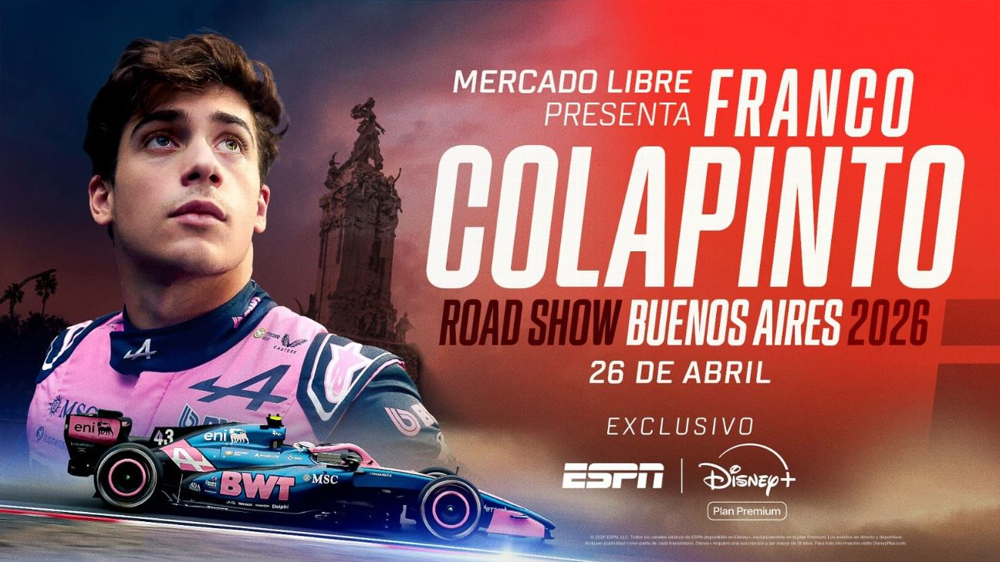

<h1 style= "color: #222; 
               font-size: 42px; 
               font-weight: 800; 
               line-height: 1.1; 
               margin: 0 auto; 
               max-width: 800px;">Franco Colapinto en Buenos Aires. La exhibición a bordo de un Fórmula 1 por las calles de Buenos Aires.</h1>

  

El piloto de 22 años realizará un road show y hará vibrar a una multitud. El piloto argentino rodará con un Lotus E20 en Palermo, en la primera actividad oficial de la Máxima en 14 años. Se espera una multitud en la presentación.

</img>

Los fanáticos de <b>Franco Colapinto</b> se preparan para una fiesta con su ídolo en Buenos Aires: se confirmó la exhibición del piloto argentino con un auto de Fórmula 1 en Palermo el domingo 26 de abril. El evento será multitudinario y se busca que sea una carta en las negociaciones para recuperar a la Máxima.

El 16 de marzo, el road show del corredor de 22 años será un pequeño trazado armado sobre la Avenida del Libertador en la zona del Monumento a los Españoles y en una de las fechas adelantadas por este medio. El auto será de la estructura de <b>Alpine</b>. “La Avenida del Libertador y la Avenida Sarmiento se transformarán en un circuito urbano de 2 km, donde tendrán lugar dos carreras oficiales, que constituirán el punto culminante de la jornada”, detalló el equipo con sede en Enstone en un comunicado.

<h2 style= "color: #222;  
               font-weight: 800; 
               line-height: 1.1;  
               text-align:left;">Lotus E20</h2>

“Conducir en casa un auto de Fórmula 1 será uno de los momentos más especiales de mi vida. Es mi forma de devolver, aunque sea un poco, todo el apoyo y el cariño que recibí desde muy chico, que me impulsa todos los días a seguir soñando con alcanzar todos mis objetivos en mi carrera. Cada mensaje, cada bandera y cada aliento siempre estuvieron presentes. Esto es para todos ustedes, para disfrutar juntos este momento especial”, dijo el corredor en la gacetilla de prensa. <b>“Nos vemos en casita, vengan todos”</b>, <a href="https://x.com/FranColapinto";>posteo</a> también en sus redes sociales tras conocerse la noticia.

En un primer momento se barajó la posibilidad de que fuese al monoplaza de años anteriores de la escudería francesa, pero será un Lotus E20 decorado con los colores de <a href="https://www.alpinecars.es/formula-1.html">Alpine</a>. Cabe recordar que la versión moderna del histórico team inglés fue con la misma estructura de Enstone entre 2012 y 2015. En 2016 volvió a llamarse Renault y desde 2021 adoptó su denominación actual.

<h2 style= "color: #222;  
               font-weight: 800; 
               line-height: 1.1;  
               text-align:left;">Circuito de la Exhibición</h2>

La expectativa es enorme por la presencia de Franco Colapinto a bordo de un auto de F1 y con el condimento especial de la música de un motor V8. El gran desafío de los organizadores será contener a una multitud que le dará la bienvenida a su ídolo y está ávida de la Máxima. El evento puede resultar clave para poder recuperar el Gran Premio en Buenos Aires.La expectativa es enorme por la presencia de Franco Colapinto a bordo de un auto de F1 y con el condimento especial de la música de un motor V8. El gran desafío de los organizadores será contener a una multitud que le dará la bienvenida a su ídolo y está ávida de la Máxima. El evento puede resultar clave para poder recuperar el Gran Premio en Buenos Aires.

