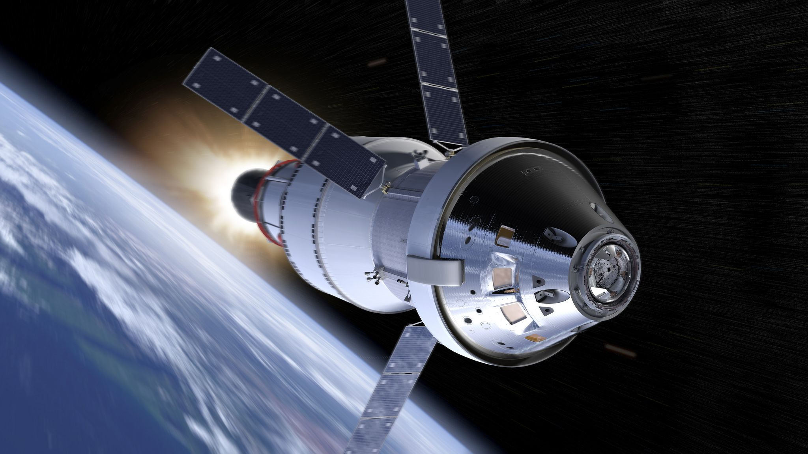

## Artemis II: informática aplicada a la exploración espacial

## ¿Qué es Artemis II?

Artemis II es una misión tripulada de la NASA cuyo objetivo es orbitar la Luna como parte del programa Artemis. 
Será la primera vez desde 1972 que humanos viajen tan lejos en el espacio.

## El rol de la informática

Misiones como Artemis II dependen de software crítico:

- Navegación de la nave  
- Sistemas vitales  
- Simulaciones previas  
- Comunicación con la Tierra  

## ¿Por qué me interesa?

Al ser estudiante de ingeniería en informática, me interesa cómo el software puede aplicarse en sistemas críticos donde no hay margen de error. Y ademas hacen posibles cosas increibles como estas.

## A futuro

Me gustaría aplicar la informática en áreas como la exploración espacial y el desarrollo de sistemas complejos.
