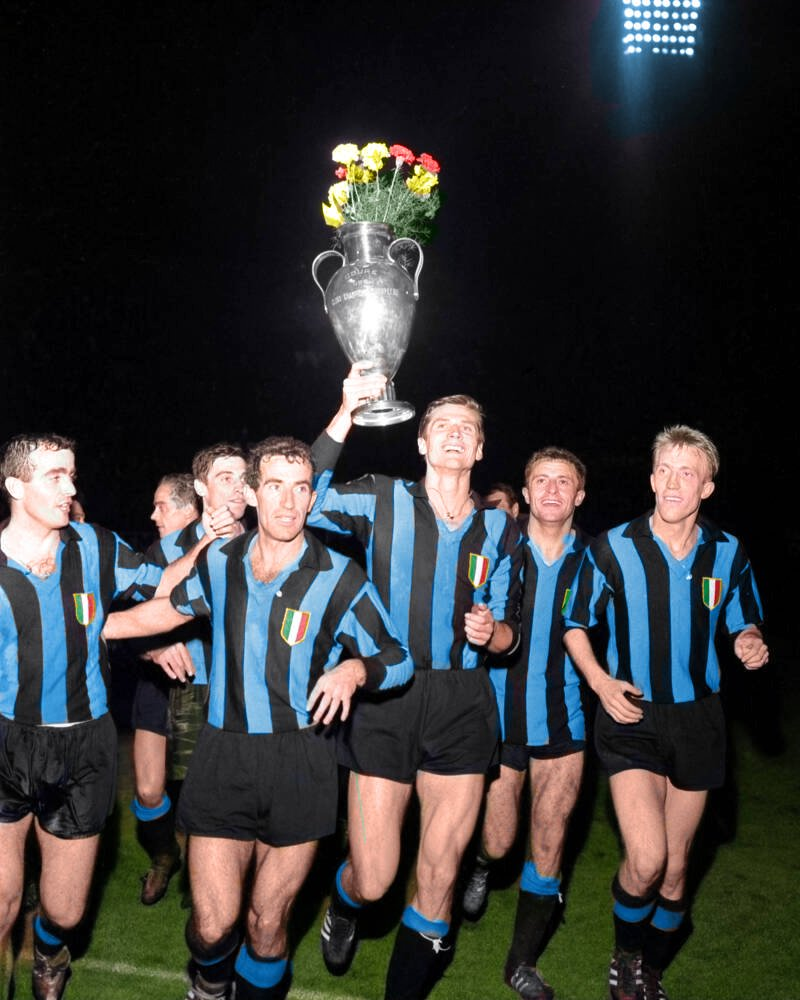
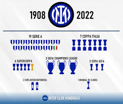
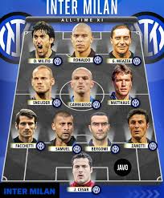

# Inter de Milan ⚫🔵

## Historia
-El Inter de Milan es un equipo de futbol mundialmente reconocido como uno de los grandes de Italia. Fue fundado en 1908 y apodado "Nerazzurros", por sus caracteristicos colores, azul y negro.

### [Inicios del club](https://wwwhttps://www.studocu.com/es-ar/document/universidad-nacional-del-sur/historia-del-arte-y-la-cultura/historia-inthttps://www.studocu.com/es-ar/document/universidad-nacional-del-sur/historia-del-arte-y-la-cultura/historia-inter-de-milan/77515589https://www.studocu.com/es-ar/document/universidad-nacional-del-sur/historia-del-arte-y-la-cultura/historia-inter-de-milan/77515589https://www.studocu.com/es-ar/document/universidad-nacional-del-sur/historia-del-arte-y-la-cultura/historia-inter-de-milan/77515589er-de-milan/77515589.studocu.com/es-ar/document/universidad-nacional-del-sur/historia-del-arte-y-la-cultura/historia-inter-de-milan/77515589)

## Palmares
-El equipo Nerazurro ha conseguido 44 titulos en total: 

🏠 Local 
- Serie A: 20 
- Coppa Italia: 9
- Supercoppa Italiana: 8

🌍 Internacionales
- Champions League: 3
- Europa League (UEFA Cup): 3
- Mundial de Clubes: 1

-Logrando en 3 oportunidades el titulo mas codiciado de europa, la Champions League.

### [Recuento de titulos oficiales](https://www.transfermarkt.es/inter-de-milan/erfolge/verein/46)

## 🌟 Referentes históricos
- Javier Zanetti  
- Giuseppe Meazza  
- Sandro Mazzola  
- Giacinto Facchetti  
- Ronaldo Nazário  
- Diego Milito  
- Walter Zenga  
- Lothar Matthäus  
- Marco Materazzi  
- Lautaro Martínez 

-El club cuenta con grandisimos jugadores, increiblemente reconocidos a nivel mundial por su juego e influencia en el futbol, que vistieron la camiseta nerazzurra a lo largo de la historia. Estos son algunos de los mas conocidos y los mas influyentes en la historia del club.

### [Jugadores con mas partidos disputados](https://www.transfermarkt.es/inter-milan/rekordspieler/verein/46#google_vignette)
 