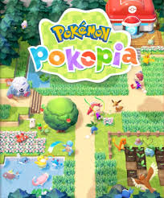
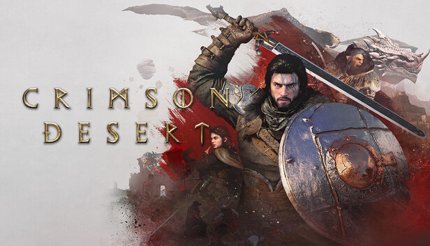
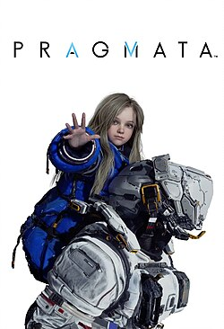
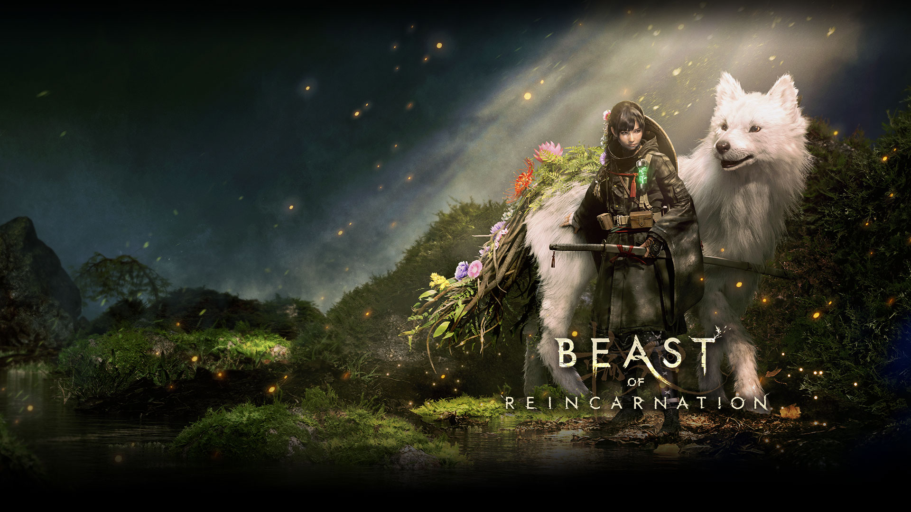

# Los lanzamientos de videjuegos mas destacados de 2026


## Febrero - [Resident Evil Requiem](https://store.steampowered.com/app/3764200/Resident_Evil_Requiem/?l=spanish)


Resident Evil Requiem es un juego de terror y supervivencia desarrollado por Capcom. Continúa la famosa saga Resident Evil, combinando exploración, combate y resolución de acertijos en un ambiente oscuro marcado por amenazas biológicas y una historia llena de tensión.

## Marzo - [Pokemon Pokopia](https://www.nintendo.com/es-ar/store/products/pokemon-pokopia-switch-2/?srsltid=AfmBOorT7osmwzSWRQBS78-NMADeAhf1n58AUyAciaoLPWpMsyQPTfrG)



Pokémon Pokopia es un spin-off desarrollado por The Pokémon Company que propone una experiencia más relajada dentro del mundo Pokémon, enfocada en la vida cotidiana, la interacción con criaturas y la construcción de un entorno social en lugar de combates tradicionales.

## Marzo - [Crimson Desert](https://store.steampowered.com/app/3321460/Crimson_Desert/?l=spanish)



Crimson Desert es un RPG de acción en mundo abierto creado por Pearl Abyss. Se destaca por sus gráficos realistas, combates intensos y una gran libertad de exploración ambientada en un mundo medieval fantástico.


## Abril - [Pragmata](https://store.steampowered.com/app/3357650/PRAGMATA/?l=spanish)



Pragmata es un juego de ciencia ficción desarrollado por Capcom que combina acción, exploración y una narrativa futurista en un entorno distópico, con fuerte enfoque cinematográfico y misterios tecnológicos.

## Mayo - [Forza Horizon 6](https://www.xbox.com/es-AR/games/forza-horizon-6)


Forza Horizon 6 es un juego de carreras en mundo abierto desarrollado por Playground Games, que ofrece conducción libre en escenarios detallados, gran variedad de vehículos y eventos dinámicos, con un fuerte componente online y social.

## Agosto - [Beast of Reincarnation](https://www.xbox.com/es-AR/games/beast-of-reincarnation)



Beast of Reincarnation es un juego de acción y aventura desarrollado por Game Freak, la gente detrás de Pokémon, que presenta un mundo fantástico con criaturas místicas y una historia centrada en la reencarnación, combinando exploración, combate y narrativa.


```python

```


```python

```
