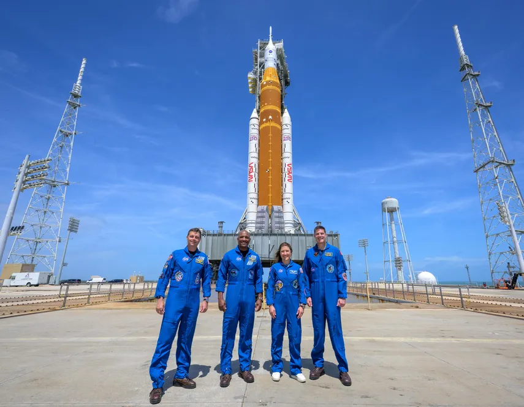
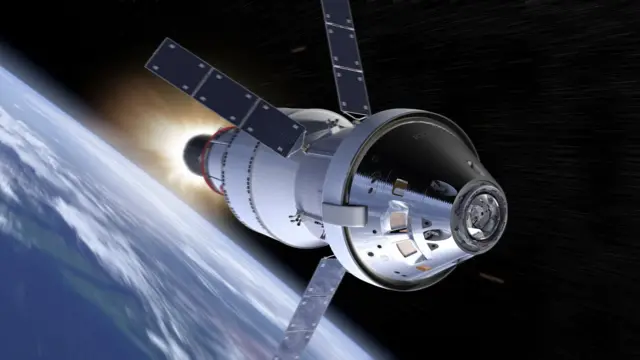
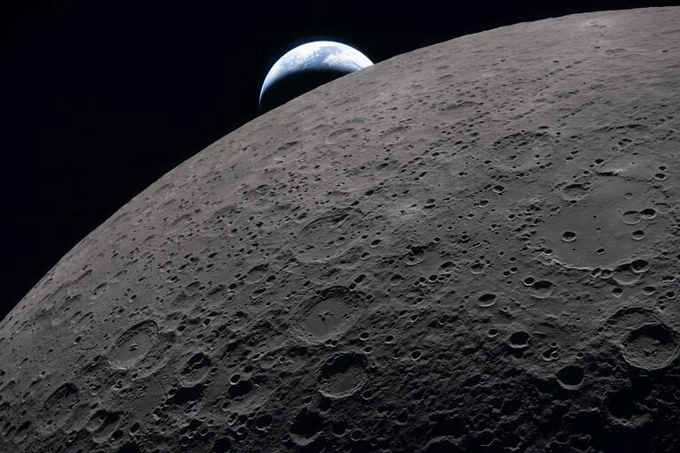

# 🌕 Artemis II: El Regreso Humano a la Luna

> **Misión completada:** 1–10 de abril de 2026  
> *El primer vuelo tripulado más allá de la órbita terrestre baja desde el Apollo 17 en 1972.*

---

## ¿Qué fue Artemis II?

Artemis II fue la primera misión tripulada del programa Artemis de la NASA. Su objetivo principal fue realizar un sobrevuelo lunar —un *flyby*— para validar los sistemas de soporte de vida de la nave *Orion* con astronautas a bordo por primera vez, y establecer las bases para futuras misiones de aterrizaje en la Luna.

La misión no aterrizó en la Luna, sino que la rodeó, permitiendo a la tripulación recolectar datos científicos y probar los sistemas de la nave en el entorno del espacio profundo.

---

## La Tripulación

| Nombre | Agencia | Rol |
|---|---|---|
| **Reid Wiseman** | NASA | Comandante |
| **Victor Glover** | NASA | Piloto |
| **Christina Koch** | NASA | Especialista de misión |
| **Jeremy Hansen** | CSA (Canadá) | Especialista de misión |

## Los Vehículos

### SLS — Space Launch System
El cohete SLS es el lanzador más potente construido por Estados Unidos, capaz de enviar la nave *Orion*, a los astronautas y su carga directamente a la Luna en un solo lanzamiento. Generó **8,8 millones de libras de empuje** al despegue.

### Orion
*Orion* es la nave de exploración diseñada para llevar y sostener a la tripulación en misiones hacia la Luna. Es la primera nave estadounidense diseñada para viajes de larga distancia más allá de la órbita terrestre baja desde las cápsulas Apollo.

---

## Cronología de la Misión

| Día | Evento |
|---|---|
| **1 de abril** | Lanzamiento desde el Kennedy Space Center (Pad 39B) a las 6:35 p.m. EDT |
| **Día 1** | Verificación de sistemas de la nave; despliegue de 4 CubeSats internacionales |
| **Días 2–5** | Tránsito hacia la Luna; pruebas de sistemas de soporte de vida y pilotaje manual |
| **Día 6** | **Sobrevuelo lunar** — la tripulación estableció un nuevo récord de distancia humana: 252.756 millas de la Tierra |
| **Días 7–9** | Retorno a la Tierra; quemas de corrección de trayectoria |
| **10 de abril** | Amerizaje en el Océano Pacífico frente a las costas de San Diego a las 5:07 p.m. PDT |

**Distancia total recorrida:** 694.481 millas (~1,1 millones de kilómetros)

---

## Récords Históricos

- **Mayor distancia recorrida por humanos:** 252.756 millas desde la Tierra, superando el récord anterior del Apollo 13 (248.655 millas, 1970).
- **Primera misión tripulada al espacio profundo en 54 años**, desde el Apollo 17 en diciembre de 1972.

---

## Objetivos Científicos y Técnicos

La misión cumplió sus objetivos primarios:

- **Sistemas de soporte de vida:** Confirmación de que *Orion* puede sostener a humanos en el espacio profundo.
- **Pilotaje manual:** Los astronautas tomaron control manual de la nave para validar su maniobrabilidad y recopilar datos para futuras operaciones de acoplamiento.
- **Ciencia:** Investigación AVATAR, que estudia cómo responden los tejidos humanos a la microgravedad y la radiación del espacio profundo.
- **Observación lunar:** Fotografías e imágenes inéditas del lado lejano de la Luna, transmitidas en tiempo real a científicos en la Tierra.

---

## Contexto: El Programa Artemis

Artemis II es la segunda misión de una serie progresiva de vuelos diseñados para devolver a los humanos a la superficie lunar:

| Misión | Año | Objetivo |
|---|---|---|
| **Artemis I** | 2022 | Vuelo no tripulado de prueba |
| **Artemis II** | 2026 | Sobrevuelo tripulado ✅ |
| **Artemis III** | ~2027 | Prueba de módulos de aterrizaje comerciales en órbita terrestre |
| **Aterrizaje lunar** | ~2028 | Primer alunizaje humano desde 1972 |
