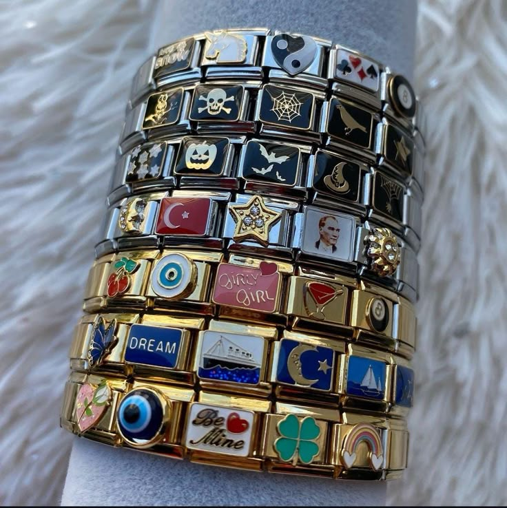
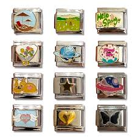

# Italian Charm Bracelets

## ¿Qué son?

Las Italian Charm Bracelets (pulseras de dijes italianas) son joyas modulares personalizables, nacidas en Italia en 1987, que consisten en una serie de eslabones de acero inoxidable conectados por bandas elásticas. Cada eslabón intercambiable presenta un diseño, letra o símbolo, permitiendo crear pulseras únicas que reflejan la personalidad del usuario.

**Caracteristicas principales:**

* Diseño Modular: Los eslabones se enganchan y desenganchan fácilmente para personalizar la pulsera, permitiendo añadir o cambiar dijes según el gusto.
* Material: Están fabricadas principalmente de acero inoxidable duradero, lo que las hace resistentes y asequibles.
* Personalización: Cada charm representa recuerdos, intereses o símbolos especiales, convirtiéndolas en una forma de "contar tu historia".
* Versatilidad: Son una tendencia duradera, popular desde los años 90 y 2000, que ha regresado con gran fuerza en redes sociales como TikTok.
* Estructura: La pulsera básica clásica suele constar de unos 18 eslabones, que se pueden personalizar con diversos charms decorativos. 

## ¿Qué son los charms?

A diferencia de los charms tradicionales que cuelgan de una cadena, los charms de los brazaletes italianos son eslabones rectangulares y planos que se conectan entre sí para formar la propia banda de la pulsera.

**Caracteristicas de los charms**

* Material: Generalmente están fabricados en acero inoxidable de alta calidad, lo que los hace resistentes al agua y al uso diario.
* Diseños: Los diseños (letras, símbolos, piedras o esmaltes) están grabados o soldados directamente sobre la cara plana del eslabón.
* Tamaño Estándar: La mayoría de las marcas, como el referente original Nomination (1.3.3), utilizan un tamaño estándar de 9 mm, lo que permite que charms de diferentes marcas sean compatibles entre sí.

## ¿Dónde los podes conseguir?

En Argentina, los charms italianos han vuelto a ser tendencia y se pueden conseguir principalmente a través de tiendas especializadas de accesorios, joyerías contemporáneas y plataformas de venta online. Las tiendas mas conocidas son: Avanti Charm, Reivan, y Da Corte. Todas tienen su propia pagina web para poder hacer la compra online, con envios a todo el país!

* [Avanti Charm](https://avanticharm.tiendanegocio.com/)
* [Reivan](https://reivan4.mitiendanube.com/paso-1-elegir-brazalete)
* [Da Corte](https://www.joyasdacorte.com/pulseras-italianas/charms/)