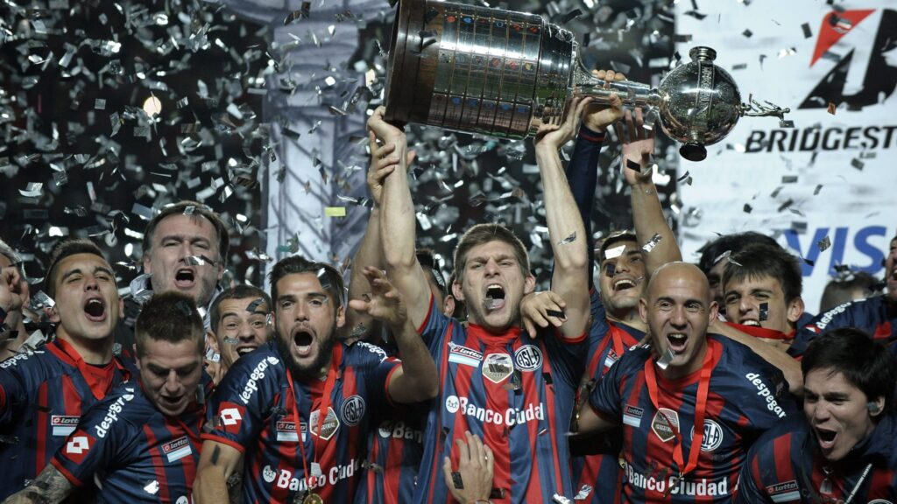

# Club Atlético River Plate ⚪🔴

## Historia

Club Atlético River Plate fue fundado el **25 de mayo de 1901** en el barrio de La Boca, Buenos Aires, a partir de la fusión entre el River Plate Football Club y el Santa Rosa Football Club. Con el tiempo, el club se trasladó primero a Palermo y finalmente, en 1923, se instaló en el barrio de Núñez, donde construyó su estadio definitivo: el Monumental.

A lo largo de más de un siglo, River Plate se convirtió en uno de los clubes más grandes e influyentes de Argentina y de toda América del Sur, reconocido tanto por su historia deportiva como por su infraestructura y su escuela de formación de jugadores.

---

## Identidad

- **Apodo:** "Los Millonarios" (por la política de fichajes costosos en los años 30)
- **Colores:** Blanco con una franja roja diagonal en la camiseta
- **Estadio:** Estadio Monumental Antonio Vespucio Liberti, ubicado en el barrio de Núñez, con capacidad para más de 84.000 espectadores. Es el estadio más grande de Argentina y uno de los más grandes de América.

---

## El Estadio Monumental

Inaugurado en **1938**, el Estadio Monumental fue ampliándose con el tiempo hasta convertirse en el coliseo del fútbol argentino. Fue sede de la **final del Mundial de 1978**, donde Argentina se coronó campeona del mundo. Es conocido por su imponente ambiente y por las noches históricas que vivió, como la final de la Copa Libertadores 2015 ante Tigres de México.

---

## Palmarés

River Plate es uno de los clubes más ganadores de América. A lo largo de su historia acumuló un palmarés muy destacado tanto a nivel local como internacional.

### 🏠 Títulos locales
- **Primera División Argentina:** 38 títulos
- **Copa Argentina:** 1 título
- **Supercopa Argentina:** 3 títulos

### 🌍 Títulos internacionales
- **Copa Libertadores:** 5 títulos (1986, 1996, 2015, 2018, 2019)
- **Copa Intercontinental:** 1 título (1986)
- **Copa Sudamericana:** 1 título (2014)
- **Recopa Sudamericana:** 4 títulos
- **Copa de Honor Municipalidad de Buenos Aires:** 1 título

---

## La Copa Libertadores 2018: La Final de Madrid

El **9 de diciembre de 2018** quedó grabado en la memoria colectiva del fútbol sudamericano. Por primera vez en la historia, la final de la Copa Libertadores se disputó fuera de América, en el estadio Santiago Bernabéu de Madrid.

River Plate enfrentó a su eterno rival, Boca Juniors, en la primera "Superfinal" de la historia de la competición. El partido terminó 3-1 para River, con goles de Pity Martínez y Quintero, y fue uno de los momentos más emocionantes y controversiales del fútbol argentino moderno. La euforia de los hinchas de River en el mundo fue enorme y se vivió como un hito histórico.

---

## Referentes históricos

River Plate ha tenido a lo largo de su historia jugadores de nivel mundial que dejaron una huella imborrable en el club y en el fútbol argentino.

| Jugador | Época | Característica |
|---|---|---|
| **Ángel Labruna** | 1939–1959 | Máximo ídolo de la época gloriosa de "La Máquina" |
| **Alfredo Di Stéfano** | 1945–1949 | Luego leyenda del Real Madrid, brilló antes en River |
| **Norberto Alonso** | 1972–1989 | Apodado "Beto", elegante mediocampista |
| **Enzo Francescoli** | 1983–1997 | Ídolo máximo del club, elegante como pocos |
| **Marcelo Gallardo** | 1993–2009 | Ídolo como jugador y luego el entrenador más exitoso de la historia del club |
| **Ariel Ortega** | 1992–2008 | "El Burrito", gambeteador y querido por la hinchada |
| **Hernán Crespo** | 1993–2000 | Goleador en la época de la segunda Libertadores |
| **Radamel Falcao** | 2005–2009 | "El Tigre", uno de los goleadores más temidos del fútbol mundial |
| **Leonardo Ponzio** | 2010–2019 | Capitán y símbolo del ciclo Gallardo |
| **Franco Armani** | 2018–presente | Uno de los mejores arqueros de Argentina |

---

## Épocas de Oro

### La Máquina (1941–1947)
Considerado el mejor equipo de la historia del fútbol argentino en su época. Con figuras como Ángel Labruna, Pedernera, Moreno, Muñoz y Loustau, River dominó el fútbol local con un estilo ofensivo y vistoso que deslumbró al mundo.

### El ciclo Ramón Díaz (1995–1996)
Bajo la dirección de Ramón Díaz, River ganó la **Copa Libertadores de 1996** con una generación brillante encabezada por Enzo Francescoli y Hernán Crespo, consagrándose como el mejor equipo de América.

### El ciclo Marcelo Gallardo (2014–2022)
Sin dudas el período más exitoso de la historia moderna del club. "El Muñeco" Gallardo llevó a River a ganar **2 Copa Libertadores** (2015 y 2018), 1 Copa Sudamericana, 2 Recopas Sudamericanas y varios títulos locales. Construyó un equipo con identidad, presión alta y juego colectivo, que se convirtió en referencia del fútbol sudamericano.

---

## Rivalidades

- **Superclásico vs. Boca Juniors:** Es la rivalidad más importante del fútbol argentino y una de las más apasionantes del mundo. Se disputa desde comienzos del siglo XX y moviliza a millones de personas tanto dentro como fuera del país.
- **Clásicos locales:** También mantiene rivalidades con Racing Club, San Lorenzo e Independiente, conocidos como los "Grandes de Buenos Aires y Avellaneda".

---

## La hinchada: Banda de la Franja Roja

La hinchada de River Plate es conocida como la **Banda de la Franja Roja**, aunque popularmente también se los llama "millonarios". El apoyo de la hinchada es histórico; las noches en el Monumental tienen una atmósfera única, especialmente en los partidos de Copa Libertadores.

---

## Legado

River Plate es reconocido a nivel continental por tres pilares fundamentales:

1. **Fútbol ofensivo y de calidad:** Desde "La Máquina" hasta el ciclo Gallardo, siempre apostó por un juego elaborado y vistoso.
2. **Formación de jugadores:** Su escuela de fútbol juvenil es una de las más respetadas de Argentina y del continente, produciendo talentos que luego brillaron en las mejores ligas del mundo.
3. **Infraestructura:** El Monumental, la Ciudad Deportiva y su organización institucional lo posicionan como uno de los clubes más profesionales de América Latina.

---

## Referencias

- [Wikipedia - Club Atlético River Plate](https://es.wikipedia.org/wiki/Club_Atl%C3%A9tico_River_Plate)
- [Sitio oficial de River Plate](https://www.cariverplate.com.ar/)
- [Palmarés completo en Transfermarkt](https://www.transfermarkt.es/river-plate/erfolge/verein/2841)
- [Estadio Monumental](https://es.wikipedia.org/wiki/Estadio_Monumental_Antonio_Vespucio_Liberti)
