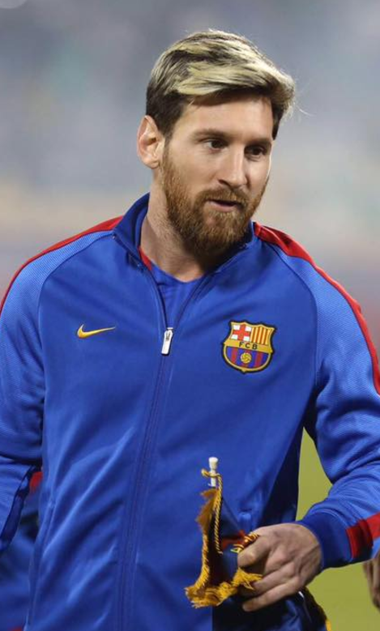
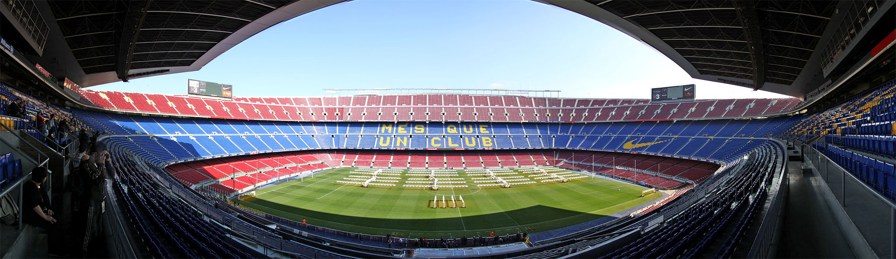

<h1 style="color: #1a1a1a;
           font-size: 48px;
           font-weight: 900;
           letter-spacing: 1px;">
🐐 Lionel Messi: La historia de una leyenda eterna
</h1>

 

:contentReference[oaicite:0]{index=0} es uno de los futbolistas más grandes de todos los tiempos. Su historia combina talento natural, esfuerzo constante y una pasión inigualable por el fútbol que lo llevó a la cima del deporte mundial.

 

<h2 style="color:#222;">🌟 Inicio de su historia</h2>

Lionel Messi nació en Rosario, Argentina, en 1987. Desde muy pequeño mostró una habilidad increíble con la pelota, destacándose entre jugadores mucho mayores que él. Sin embargo, su infancia no fue fácil, ya que tuvo que enfrentar un problema de crecimiento que amenazaba su desarrollo como futbolista.

A pesar de las dificultades, su talento era tan grande que el FC Barcelona decidió apostar por él, ofreciéndole tratamiento médico y la posibilidad de entrenar en sus inferiores. Ese momento cambió su vida para siempre.

 

 

<h2 style="color:#222;">🔵⚽ Era dorada en el FC Barcelona</h2>

En el FC Barcelona, Messi creció hasta convertirse en el jugador más importante del club. Su debut en el primer equipo marcó el inicio de una era histórica. Con el tiempo, rompió récords de goles, asistencias y títulos.

Ganó múltiples Ligas de España, Champions League y Balones de Oro, convirtiéndose en el emblema del club durante más de una década. Su conexión con los hinchas fue única e inolvidable.

 

<h2 style="color:#222;">🏟️ Camp Nou: el templo de sus sueños</h2>

El estadio :contentReference[oaicite:1]{index=1} fue el escenario donde Messi escribió las páginas más importantes de su carrera. Allí marcó goles históricos, protagonizó remontadas inolvidables y levantó trofeos que hicieron historia.

Cada partido en el Camp Nou era una demostración de su magia, donde el público sabía que podía presenciar algo único en cualquier momento.

 

 

<h2 style="color:#222;">🇦🇷 La selección argentina</h2>

Con la selección argentina, Messi vivió momentos de alegría y también de frustración. Sin embargo, nunca se rindió y siguió luchando por su país hasta alcanzar la gloria.

Finalmente, logró levantar la Copa América en 2021 y la Copa del Mundo en 2022, consolidando su legado como uno de los mejores de todos los tiempos.

 

 

<h2 style="color:#222;">🏆 Conclusión</h2>

Messi es mucho más que un futbolista. Es un símbolo de esfuerzo, perseverancia y talento. Desde sus humildes comienzos en Rosario hasta convertirse en campeón del mundo, su historia inspira a millones de personas alrededor del planeta.

 

🐐 Lionel Messi será recordado como una leyenda eterna del fútbol mundial

